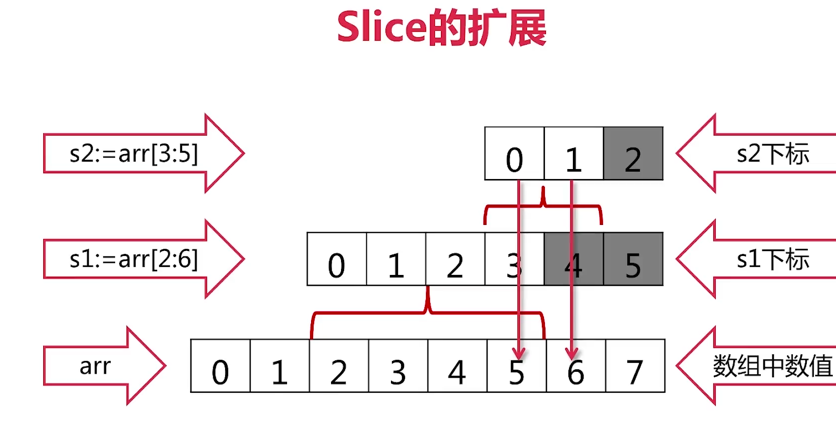
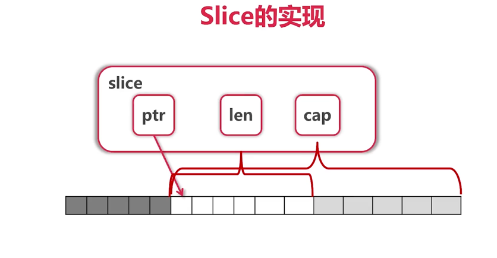

# 02 GO语言基础

## 2-1 变量定义
+ 声明变量时候，会自动为变量赋一个初值
+ 也可以不写类型，编译器会自动判断
+ 有几种赋值方法，见代码
+ 函数外面使用 := 不行
+ 没有全局变量 只是包级别的变量
```go
// 1
var (
	aa = 3
	ss = "kkk"
	bb = true
)
// 2
func variableZeroValue() {
	var a int
	var s string
	fmt.Printf("%d %q\n", a, s)
}
// 3
func variableInitialValue() {
	var a, b int = 3, 4
	var s string = "abc"
	fmt.Println(a, b, s)
}

func variableTypeDeduction() {
	var a, b, c, s = 3, 4, true, "def"
	fmt.Println(a, b, c, s)
}

func variableShorter() {
	a, b, c, s := 3, 4, true, "def"
	b = 5
	fmt.Println(a, b, c, s)
}
```

## 2-2 变量类型
### 变量类型一览
+ bool string
+ (u)int 8 16 32 64 uintptr
+ byte rune(32位，相当于其他语言的char)
+ float32 64 complex64 128（复数 实部float32 虚部float32）
```go
//欧拉公式验证函数（复数）
func euler() {
	fmt.Printf("%.3f\n",
		cmplx.Exp(1i*math.Pi)+1)
}
```
### 类型转换
只有强制类型转换，不能隐式转换
```go
//勾股定理 验证强制类型转换
func triangle() {
	var a, b int = 3, 4
	fmt.Println(calcTriangle(a, b))
}

func calcTriangle(a, b int) int {
	var c int
	c = int(math.Sqrt(float64(a*a + b*b)))
	return c
}
```
## 2-3 常量
### 常量声明与使用
- 常量的声明和var差不多 不过要用const
- 数值常量可以作为各种类型使用
```go
func consts() {
	const (
		filename = "abc.txt"
		a, b     = 3, 4
	)
	var c int
	c = int(math.Sqrt(a*a + b*b))
	fmt.Println(filename, c)
}
```
### 枚举类型（自增类型的枚举类型）
- 使用const()声明一些变量
- 可以用iota简化代码，iota是定义自增的一个表达式
```go
func enums() {
	const (
		cpp = iota
		_
		python
		golang
		javascript
	)

	const (
		b = 1 << (10 * iota)
		kb
		mb
		gb
		tb
		pb
	)

	fmt.Println(cpp, javascript, python, golang)
	fmt.Println(b, kb, mb, gb, tb, pb)
}
```

## 2-4 条件语句
### if
- if 后面可以跟表达式，赋值操作
- 作用域在if语句块
```go
const filename = "abc.txt"
if contents, err := ioutil.ReadFile(filename); err != nil {
	fmt.Println(err)
} else {
	fmt.Printf("%s\n", contents)
}
```
### switch
- go自动break，如果需要执行后面的，用fallthrough
- swithch 后面可以没有表达式,它会匹配true
- case后的常量值不能重复 
- case后可以有多个常量值 
- fallthrough应该是某个case的最后一行。如果它出现在中间的某个地方，编译器就会抛出错误。
```go
func grade(score int) string {
	g := ""
	switch {
	case score < 0 || score > 100:
		panic(fmt.Sprintf(
			"Wrong score: %d", score))
	case score < 60:
		g = "F"
	case score < 80:
		g = "C"
	case score < 90:
		g = "B"
	case score <= 100:
		g = "A"
	}
	return g
}
```
type switch使用方法，它比较的是类型而不是具体的值。它判断某个接口变量的类型，然后根据具体类型再做相应处理。注意，在type switch语句的case子句中不能使用fallthrough。
```go
	var x interface{}

	switch i := x.(type) {
	case nil:
		fmt.Printf(" x 的类型 :%T", i)
	case int:
		fmt.Printf("x 是 int 型")
	case float64:
		fmt.Printf("x 是 float64 型")
	case func(int) float64:
		fmt.Printf("x 是 func(int) 型")
	case bool, string:
		fmt.Printf("x 是 bool 或 string 型")
	default:
		fmt.Printf("未知型")
	}
```
## 2-5 循环语句
### for
- 可以省略初始条件、终止条件、自增
- 全部省略之后相当于while
```go
func convertToBin(n int) string {
	result := ""
	for ; n > 0; n /= 2 {
		lsb := n % 2
		result = strconv.Itoa(lsb) + result
	}
	return result
}

func printFile(filename string) {
	file, err := os.Open(filename)
	if err != nil {
		panic(err)
	}

	printFileContents(file)
}
func forever() {
    for {
        fmt.Println("abc")
    }
}
//for range
for i, x := range numbers {
    fmt.Printf("第 %d 位 x 的值 = %d\n", i, x)
}
```
## 2-6 函数
- 支持多参数、返回多个值时候可以起名字
- 函数式编程，参数、函数内部、返回值都可以是函数
- 调用时候可以在参数里面传函数，也可以写一个匿名函数
- 支持可变参数列表 ...int
```go
package main

import (
	"fmt"
	"math"
	"reflect"
	"runtime"
)
// eval 多返回值，关注error的处理
func eval(a, b int, op string) (int, error) {
	switch op {
	case "+":
		return a + b, nil
	case "-":
		return a - b, nil
	case "*":
		return a * b, nil
	case "/":
		q, _ := div(a, b)
		return q, nil
	default:
		return 0, fmt.Errorf(
			"unsupported operation: %s", op)
	}
}
// div 多返回值
func div(a, b int) (q, r int) {
	return a / b, a % b
}
// apply 函数式编程，参数包含函数，如何拿到函数名
func apply(op func(int, int) int, a, b int) int {
	p := reflect.ValueOf(op).Pointer()
	opName := runtime.FuncForPC(p).Name()
	fmt.Printf("Calling function %s with args "+
		"(%d, %d)\n", opName, a, b)

	return op(a, b)
}
// sum可变参数
func sum(numbers ...int) int {
	s := 0
	for i := range numbers {
		s += numbers[i]
	}
	return s
}


func main() {
	fmt.Println("Error handling")
	if result, err := eval(3, 4, "x"); err != nil {
		fmt.Println("Error:", err)
	} else {
		fmt.Println(result)
	}
	q, r := div(13, 3)
	fmt.Printf("13 div 3 is %d mod %d\n", q, r)
    // 匿名函数调用
	fmt.Println("pow(3, 4) is:", apply(
		func(a int, b int) int {
			return int(math.Pow(
				float64(a), float64(b)))
		}, 3, 4))

	fmt.Println("1+2+...+5 =", sum(1, 2, 3, 4, 5))
	
}
```
## 2-7 指针
- 指针不能运算
- 参数传递问题，只有值传递一种方式，如果函数接收的是指针，则将指针拷贝一份，传进函数；如果是对象（结构），根据具体情况在封装的时候确定要传值还是要传指针
```go
package main

import "fmt"

//值传递 没用
//func swap(a, b  int ){
//	b,a =a,b
//}
//改,swap更好的实现
func swap_gai(a, b int) (int, int) {
	return b, a
}

// 指针传递
func swap1(a, b *int) {
	*b, *a = *a, *b
}

// 指针类型
func main() {
	var a int = 2
	var pa *int = &a
	*pa = 3
	fmt.Println(a)
	//指针不能运算

	//参数传递
	//go语言是值传递
	//穿值类型和指针类型需要根据情况来看
	a1, b1 := 3, 4
	swap1(&a1, &b1)
	fmt.Println(a1, b1)
	fmt.Println(*&a)
	a1, b1 = swap_gai(a1, b1)
	fmt.Println(a1, b1)
}

```

# 03 内建容器
## 3-1 数组
### 数组声明
```go
	var arr1 [5]int
	arr2 := [3]int{1, 3, 5}
	arr3 := [...]int{2, 4, 6, 8, 10}//有...是数组，没有是切片
	var grid [4][5]int
```
### 数组遍历
- 普通方法
- range方法

- 数组是值类型，在函数中进行赋值是不会变的，因为是值类型拷贝了一份值，改变不了外面的值
- [5]int和[10]int不是一种数组
```go
func printArray(arr [5]int) {
	arr[0] = 100
	for i, v := range arr {
		fmt.Println(i, v)
	}
}
//如果在[5]int前面加一个*，就变成指针传递了，这样就可以改变了
//数组长度
fmt.Println(len(g))
```
## 3-2 切片
### slice
- slice本身没有数据，是底层数组的一个视图,改变slice的值，相应数组的值也会改变
```go
arr := [...]int{0, 1, 2, 3, 4, 5, 6, 7}

fmt.Println("arr[2:6] =", arr[2:6])
fmt.Println("arr[:6] =", arr[:6])
s1 := arr[2:]
fmt.Println("s1 =", s1)
s2 := arr[:]
fmt.Println("s2 =", s2)
fmt.Println("After updateSlice(s1)")
updateSlice(s1)
fmt.Println(s1)
fmt.Println(arr)

fmt.Println("After updateSlice(s2)")
updateSlice(s2)
fmt.Println(s2)
fmt.Println(arr)
```
- slice还可以在reslice
```go
        fmt.Println("Reslice")
	fmt.Println(s2)
	s2 = s2[:5]
	fmt.Println(s2)
	s2 = s2[2:]
	fmt.Println(s2)
```
- slice扩展，正常取s1[4]是会报错的，但是通过切片的扩展方式可以将s1[4]拿到
- 只能向后扩展，不能向前扩展
- s[i]不能超过len，向后扩展不能超过cap
```go
arr := [...]int{0, 1, 2, 3, 4, 5, 6, 7}
s1 = arr[2:6]
s2 = s1[3:5]
s2 = s1[3:7]//超过了cap 就会报错

```
这是s1和s2的值

slice的底层实现

